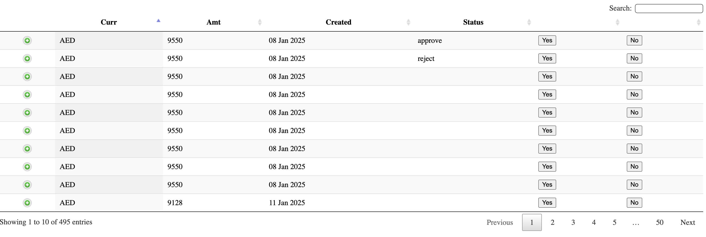
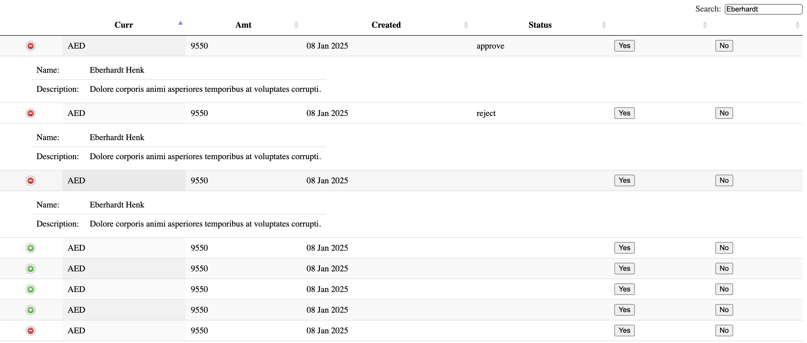
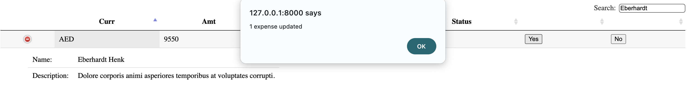

# How to Get Started

## Prerequisites
- **Python version:** Python 3
- **Dependencies:** Install the required packages using the `requirements.txt` file.

### Install Dependencies
Run the following command to install the required Python libraries:
```bash
pip install -r requirements.txt
```

---

## Starting the Server
Run the Django development server with the following command:
```bash
python manage.py runserver
```

Once the server is running, navigate to the home page in your browser:
```
127.0.0.1:8000/home
```


---

## Features of the Application

### 1. **Search Functionality**
- Users can search for any field displayed in the table.
- To search for multiple fields in the same row, use the search bar and separate the keys with spaces.
  
  **Example:** Searching for `pending binny` will filter rows containing both "pending" and "binny" in the same row.
  

### 2. **Update Expense Status**
- Users can easily update the status of an expense by clicking the **Yes/No** buttons at the end of each row.
- When a status is updated:
  - The corresponding row in the PostgreSQL database is updated.
  - The frontend table row is refreshed to reflect the change.
  - A success alert is displayed on the browser, confirming the action.
  
  - 
### 3. **View Row Details**
- For additional details about a specific row, users can expand the row.
  - This action reveals the **description** and **User Name** for the selected entry.

---

## Optimized User Interface
- The frontend is designed to be responsive and optimized for both **mobile** and **desktop** users.
- All functionalities (search, update status, view details) are seamless across devices.

